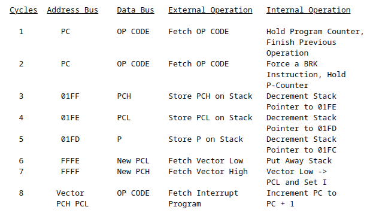
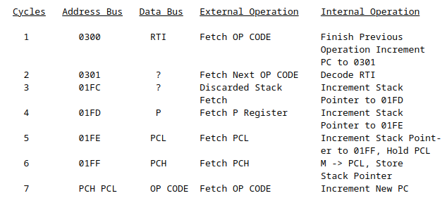
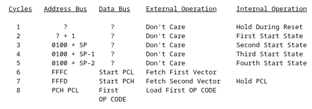

# NES architecture

## Clock
- NTSC: 21477272 Hz
- PAL : 26601712 Hz
- 60FPS : 21441960 HZ

## CPU

- RP2A03, clone of 6502, but with no decimal mode
  - [CPU ref](https://www.nesdev.org/obelisk-6502-guide/)
- CPU Clock = Console clock / 12
  - /16 in PAL
  
- Registers
  - PC : Program Counter
    - Points to the next instructions to run
  
  - SP : Stack Pointer
    - Points to a stack between 0x0100 et 0x01FF
    - Stack grows downwards (to push, decrement pointer)
    - Contains LSB of next free spot
  
  - A : Accumulator
  
  - X : 8 bit register
    - can be used to read / write to SP
  
  - Y : 8 bit register

  - P : Processor status
    - Allow to read CPU flags as a binary number as such : N V 1 B D I Z C

- Flags
  - N : negative
    - 7th bit of result of last op is 1

  - V : Overflow
    - Set when overflow of signed numbers occurs (-128 to 127)
      - Triggers when the 7th of 2 inputs are the same and the 7th bit of the outputs is different
      - Uses 2's complement for signed numbers
      - See [This page](https://www.righto.com/2012/12/the-6502-overflow-flag-explained.html)

  - B : Break
    - Set when the BRK command is run

  - D : Decimal
    - Set decimal mode, unused in NES

  - I : Interrupt disable
    - Set if the interrupts are disabled (Interract with SEI and CLI)
  
  - Z : Zero
    - When the result of the last operation is 0
  
  - C : Carry
    - When there's an overflow from bit 7 to 0

- [Instruction set](https://www.nesdev.org/obelisk-6502-guide/reference.html)
- Interrupts :
  - IRQ : Interrupt request, jumps to code pointed by 0xFFFE-0xFFFF
    - Level sensitive: reacts when the pin is low
    - Means an interrupt will stay pending when I is up, and be immediately handeled when I comes back down
    - Interrupts sequence :
    - 
    - Automatically brings the I flag up
    - RTI Sequence :
    - 

  - NMI : Same but user unable to disable, jumps to 0xFFFA-0xFFFB
    - Edge sensitove: reacts when pin switches from high to low
    - Ovverides I

  - RESET : CPU reset, jumps to 0xFFFC-0xFFFD
    - Power on cycle, when the reset line goes high :
    - 
    - Interrupt disable flag is set during start-up sequence

